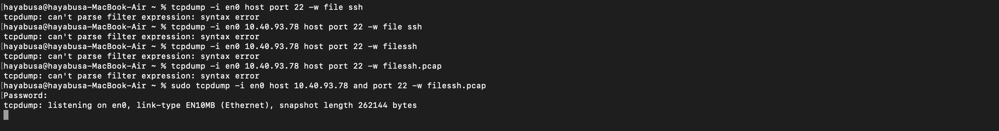
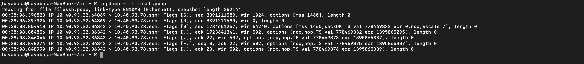

# Tcpdump Traffic Analysis

## Overview

This project demonstrates the use of `tcpdump` to capture and analyze 
network traffic during SSH-related activities in a controlled lab 
environment.

The objective of this project is to understand how packet capture can be 
used for network troubleshooting, security monitoring, and incident 
investigation.

## Environment

* Attacker Machine: Kali Linux
* Victim Machine: Debian Linux
* Packet Capture Tool: tcpdump
* Network Type: Local Virtual Network

## Scenarios

### 1. Verify SSH Service Availability

The victim machine was configured to run an SSH service. Tcpdump was used 
to monitor incoming SSH traffic.

Command:

```bash
sudo tcpdump -i any port 22
```

**Screenshot:**



---

### 2. Detect SSH Connection Attempts

The attacker initiated an SSH connection to the victim machine.

**Command:**

```bash
sudo tcpdump -i any host 10.40.93.32 and port 22
```

**Observation:**

* TCP packets were observed between the attacker and victim.
* The packet capture confirmed that the SSH service was reachable.

**Screenshot:**



---

### 3. Observe Nmap Scanning Activity

The attacker performed reconnaissance against the victim using Nmap.

**Observation:**
Tcpdump captured packets associated with the scanning process, 
demonstrating how network administrators can identify enumeration 
attempts.

**Screenshots:**


---

## Key Takeaways

* Tcpdump is useful for capturing and analyzing network traffic directly 
from the command line.
* Administrators can use tcpdump to troubleshoot network issues and 
investigate suspicious activity.
* Packet captures can provide valuable evidence during incident response 
activities.

## Skills Demonstrated

* Linux command-line usage
* Packet capture using tcpdump
* Basic traffic analysis
* SSH traffic monitoring
* Recognition of reconnaissance activities

